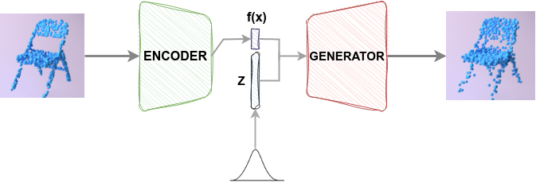

# Wasserstein GAN with gradient penalty for 3d point cloud generation

<div align="center">
  	
    
</div>

This repository contains a PyTorch implementation inspired by [Learning Representations and Generative Models for 3D Point Clouds](http://proceedings.mlr.press/v80/achlioptas18a.html) that aims to analyze and improve the plain Wasserstein GAN with the idea of guided latent spaces for point cloud shape generation.

## Install 🐙
Clone repo and install [requirements.txt](https://github.com/BrownVisualProsthesisProject/Visual_prosthesis/blob/main/requirements_jetson.txt) in a
[**Python>=3.7.0**](https://www.python.org/) environment ([venv](https://virtualenv.pypa.io/en/latest/) [poetry](https://python-poetry.org/)).
```bash
pip install -r requirements.txt
```

## Usage 💡

To train a model on point clouds sampled from 3D shapes, you need to download the dataset, which can be found in this [repository](https://github.com/square-1111/3D-Point-Cloud-Modeling) and place it inside the data folder.

To train a model on single-class point clouds sampled from 3D shapes:
* Wasserstein GAN (WGAN)
```bash
    python train_gan.py
```
* Autoencoder
```bash
    python train_autoencoder.py
```
* WGAN with Chamfer Distance and Latent Guided WGAN
```bash
    python train_latent_guided_gan.py
```
You can find multiple constants and hyperparameters in [constanst_AE.py](https://github.com/jorgechang/3DWGAN/blob/main/constants_AE.py) and [constanst_WGAN.py](https://github.com/jorgechang/3DWGAN/blob/main/constants_WGAN.py).
Specifically, to train Latent Guided WGAN, it is necessary to change the constant GUIDED_SIZE to 0.

## Method 📓

A generative adversarial network (GAN) is used for point cloud shape generation. Specifically, a Wasserstein GAN with a gradient penalty to enforce the Lipschitz constraint is trained with different procedures and tweaks to improve the quality of the generations. 

WGANs training is difficult and requires extensive hyperparameter tuning to avoid failure modes such as mode collapse and convergence failure; therefore, another loss objective for the generator is also tested:

$$L_{G} = -\frac{1}{m} \sum_{i=1}^{m} D(G(z^{(i)})) + BCD(G(z^{(i)}),Y^{(i)})$$

 Where $BCD(G(z^{(i)}),Y^{(i)})$ represents the bidirectional [Chamfer Distance](https://github.com/krrish94/chamferdist), which computes the average distance between the generations and the batch shapes in both directions.

Finally, an idea similar to [latent guided image synthesis](https://arxiv.org/abs/1612.00005) is used to alleviate GAN failure modes and obtain better shape generations by introducing an additional prior on the random noise input. Mainly, a standard Autoencoder models the prior with a reconstruction loss based on the Chamfer distance between the input and the output. 


### Models

The Autoencoder and WGAN models operate directly on point clouds using the architecture described in [PointNet: Deep Learning on Point Sets for 3D Classification and Segmentation](https://arxiv.org/abs/1612.00593).

#### Autoencoder

The Autoencoder operates on 1024 × 3 point set input. The architecture of the
Encoder uses the PointNet global feature extractor without batch normalization, as stated in [Improved Training of Wasserstein GANs](https://dl.acm.org/doi/10.5555/3295222.3295327), that maps the input to a latent space of size 16. The Decoder is a series of five dense layers with sizes 16, 256, 512, 1024, and 1024, with layer normalization and [GELU](https://arxiv.org/abs/1606.08415) activation except for the last layer.


#### GAN

The Critic (discriminator) operates on 1024 × 3 point set input. The architecture of the
discriminator, once again, uses the PointNet global feature extractor without batch normalization, followed by a fully connected layer. The Generator is a series of dense layers like the Decoder, with layer normalization, GELU activation, and Leaky ReLU that takes a Gaussian noise vector along with a vector of length 16 as input represents the latent features of the shapes when training the latent space guided GAN.


### Training details ⚗️

Each model was trained for single shape generation using 1024 points from the plane and chair shapes from the Shapenet core dataset, a batch size of 128, and AdamW optimizer with default parameters.

The autoencoder was trained maximally for 500 epochs and had a latent code of size (1,16).

<div align="center">
   
   

  <sub>Autoencoder losses for planes and chairs, respectively.</sub>
</div>

The WGAN was trained maximally for 300 epochs; the input of the generator comes from a randomly drawn sample
Z ~ N(0, 0.04), and 5 x 10^(-5) as learning rate for the generator and 1.5 x 10^(-4) for the discriminator.

The Critic was trained five times more than the generator with a gradient penalty of 30.

<div align="center">
   
   

  <sub>WGAN Generator and Critic losses for planes and chairs, respectively.</sub>
</div>

<div align="center">
   
   

  <sub>WGAN Generator and Critic losses (Generator with BCD) for planes and chairs, respectively.</sub>
</div>

For the last training procedure, the previously trained Encoder obtains the latent representation of the batch shapes. Then, this representation is appended to the noise Z, having an input of size 144 for the Generator.

<div align="center">
   

  <sub>Latent guided WGAN diagram.</sub>
</div>

<div align="center">
   
   

  <sub>Latent guided WGAN Generator and Critic losses (Generator with BCD loss) for planes and chairs, respectively.</sub>
</div>

## Results 🎯

This section presents the ground truth shapes against the Autoencoder reconstructed shapes; the WGAN with and without BCD added to the Generator loss generations; the latent WGAN generations guided with the latent representation of the original shapes; and finally, completely new generations from the latent guided WGAN using a pure noise vector of size 144. 


<div align="center">
   
   
   
   

  <sub>Ground truth shapes.</sub>
</div>

<div align="center">
   
   
   
   

  <sub>Autoencoder reconstructed shapes.</sub>
</div>

<div align="center">
   
   
   
   

  <sub>WGAN generated shapes.</sub>
</div>

<div align="center">
   
   
   
   

  <sub>WGAN with BCD generated shapes.</sub>
</div>

<div align="center">
   
   
   
   

  <sub>Latent Guided WGAN generated shapes with noise and latent representation.</sub>
</div>

<div align="center">
   
   
   
   

  <sub>Trained latent guided WGAN with pure noise inputs generated shapes.</sub>
</div>


## Discussion 💬
The plain WGAN was the most challenging model to train, as it tends to reach failure modes. For planes, it reaches mode collapse as well as for the chairs, in addition to not converging. 

Adding the bidirectional chamfer distance alleviates the non-convergence failure mode and stabilizes the training. However, the model struggles to generate diversity.

The latent prior to guiding the Generator totally improves both generation quality and diversity.

To further test the Generator, a vector of size 144 (128+16) of purely random noise is fed to the Generator. For both planes and chairs, is possible to achieve diverse generations with compact pointclouds. 


## Further research and takeaways 🔮

 Exploring the latent space guidance with VAEs could generate better shapes since the Kullback–Leibler divergence will enforce the latent space to have a certain order that can be traversed easily and could probably be learned by the generator. It would also be beneficial to compare the latent guided WGAN with [Adversarial Autoencoders](https://arxiv.org/abs/1511.05644).

The original paper by [P. Achlioptas](https://arxiv.org/abs/1707.02392) uses a Sigmoid activation for the Critic. This Sigmoid activation prevented the model in this repository from learning. One explanation could be that the vanishing gradient was a problem since the model used was deeper. Using skip connections could alleviate this problem.

Instead of using the Chamfer Distance, testing the Earth Movers Distance would be interesting; this was not yet possible since training was slow. In addition, it would be worth extending this [Sinkhorn implementation](https://github.com/fwilliams/scalable-pytorch-sinkhorn) to support batch computation.

Moreover, it is possible to use and compare other architectures that work directly on point clouds, such as [PointNet++](https://arxiv.org/abs/1706.02413) and [Point-Voxel CNN](https://pvcnn.mit.edu/).

The project helped as a 3D Generative Adversarial Networks primer and to dive deep into different approaches that improve GANs, such as gradient penalty and other [tricks](https://github.com/soumith/ganhacks) used for GANs training. It also motivated me to research more about state of the art methods for [GAN stabilization](https://arxiv.org/abs/1802.05957) and architectures that enable control of the synthesis and use strong priors like [SP-GAN](https://liruihui.github.io/publication/SP-GAN/). 

Finally, if I had to do the project again, I would use a weight initialization scheme and grid search over the learning rate and gradient penalty to increase the chances of convergence and have more stable training.
Instead of incorporating components presented in [A ConvNet for the 2020s](https://arxiv.org/abs/2201.03545) that improve performance in ConvNets by adopting NLP training techniques, I would stick with known methods that are effective with GANs. Specifically, using GELU instead of Leaky ReLU appeared to be deleterious, which makes sense since GELU is similar to ReLU, and dying ReLU problem could arise.

Alternatively, I would spend more time researching and testing convolutions with an appropriate inductive bias, such as graph or point-voxel Convolutions.


## Acknowledgements ⚖️

```bibtex
@article{https://doi.org/10.48550/arxiv.1707.02392,
  doi = {10.48550/ARXIV.1707.02392},
  url = {https://arxiv.org/abs/1707.02392},
  author = {Achlioptas, Panos and Diamanti, Olga and Mitliagkas, Ioannis and Guibas, Leonidas},
  keywords = {Computer Vision and Pattern Recognition (cs.CV), Machine Learning (cs.LG), FOS: Computer and information sciences, FOS: Computer and information sciences},
  title = {Learning Representations and Generative Models for 3D Point Clouds},
  publisher = {arXiv},
  year = {2017},  
  copyright = {arXiv.org perpetual, non-exclusive license}
}

```
* https://github.com/square-1111/3D-Point-Cloud-Modeling
* https://github.com/s-chh/Pytorch-WGANGP
* https://github.com/xchhuang/PointFlowRenderer-mitsuba2
* Code is properly cited with respective licenses.
